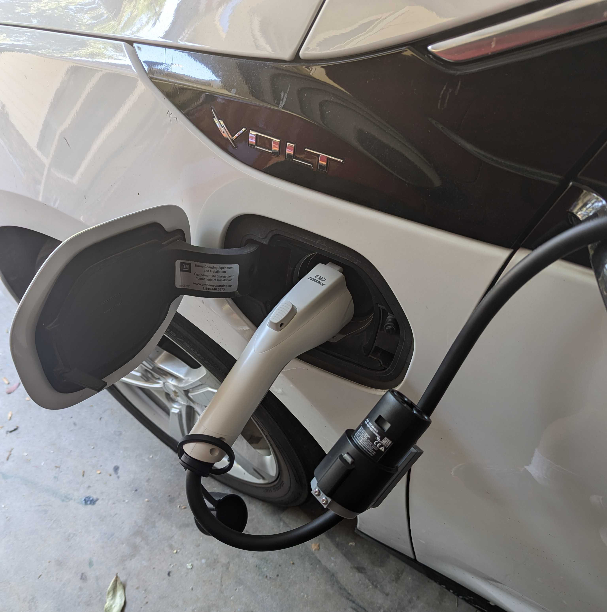
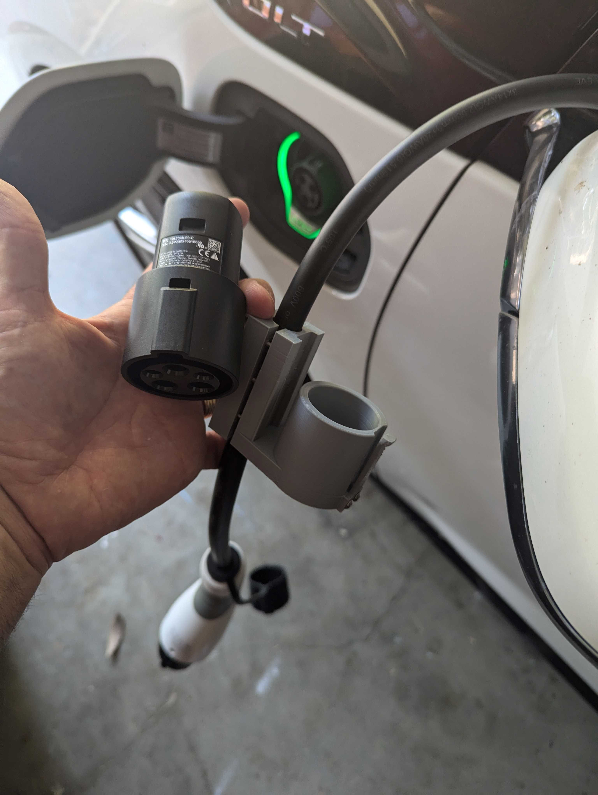
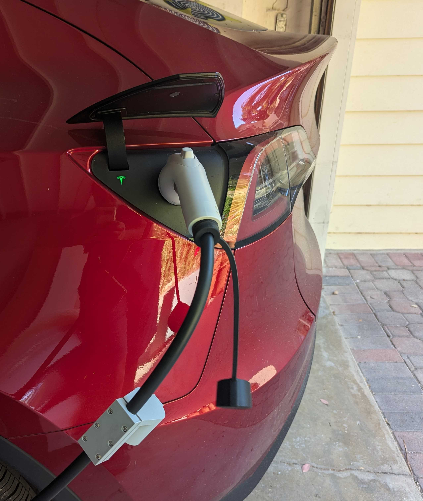

# J1772 to NACS adapter holder

This adapter holder is a must for anyone who has a Tesla (NACS) and a car that uses a J1772 (i.e. Chevy Volt).  It makes it a breeze to use the original J1772 charger and the Tesla adapter on the same cable.  Giving you quick access to the J1772 to NACS adapter.

This repo contains pictures, renders and the files for 3D Printing (STL and STEP)

# 3D printer .stl files
The 3D printing files (.stl) can be found in the ```files``` folder of this repo

# Ordering 
If you'd like to order one of these from the creator, please email him at john@compunique.com.  The cost is $20/each + Shipping.

## Renders from Fusion 360


## Pictures







## Shout out for some Fusion files
ChunkAhoy for a Fusion STEP file for Tesla J1772 adapter - https://makerworld.com/en/models/165857#profileId-182111  
EV Charger image for Fusion - https://grabcad.com/library/ev-charger-type-1-plug-sae-j1772-2  

